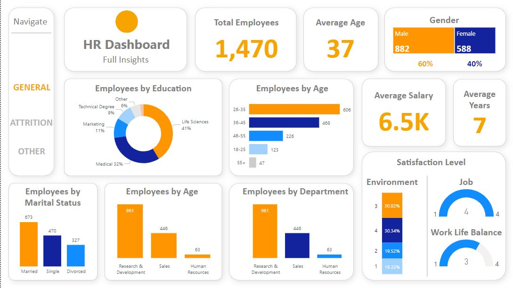

# IBM HR Power BI Report Readme

## Overview

This Power BI report provides a comprehensive analysis of employee data, focusing on three main aspects: **General Information**, **Attrition**, and **Others**. The report is designed to offer insights into employee demographics, attrition rates, and promotions/layoffs.

## Table of Contents

1. [Data Source](#data-source)
2. [Pages](#pages)
   - [General](#general)
   - [Attrition](#attrition)
   - [Others](#others)
3. [How to Use](#how-to-use)
4. [Requirements](#requirements)
5. [Contributing](#contributing)
6. [License](#license)

## Data Source

🔗 [Click here for the dataset](https://www.kaggle.com/datasets/pavansubhasht/ibm-hr-analytics-attrition-dataset)

## Data Specifications

The report is powered by a dataset containing employee information. The dataset includes fields such as age, salary, job satisfaction, department, and education. The dataset serves as the foundation for generating insights and visualizations in Power BI.

## 📊 KPIs

This dashboard/project tracks several key performance indicators (KPIs) to analyze employee data and attrition trends effectively:

1. **👥 Total Employees**  
   - Measures the total number of employees in the dataset, including current and former staff.

2. **💰 Average Salary**  
   - Calculates the mean salary across all roles and departments to understand compensation trends.

3. **⚖️ Gender Ratio**  
   - Shows the proportion of male to female employees (and other genders if applicable), helping assess diversity.

4. **⏳ Average Tenure**  
   - Computes the average number of years employees have spent at the company to assess retention.

5. **🎓 Education & Demographics Breakdown**  
   - Analyzes distributions based on:
     - Education levels (e.g., Bachelor's, Master's, PhD)
     - Age groups (e.g., 20–30, 31–40, 41–50)
     - Additional demographics where available

6. **📉 Attrition Rate by Age Group**  
   - Evaluates how employee departure rates vary across different age ranges.

7. **📆 Attrition Rate by Tenure**  
   - Analyzes employee attrition based on the number of years they’ve worked at the company.

8. **🎓 Attrition Rate by Education Level**  
   - Compares attrition percentages across educational qualifications to find correlations with retention.

9. **🏢 Attrition Rate by Department**  
   - Breaks down attrition rates by department to identify areas with higher employee turnover.

These KPIs help uncover insights that can inform strategic decisions in talent management, hiring, retention, and organizational development.

## Pages

### General

The General page provides an overview of the overall workforce. Key metrics include the total number of employees, average age, average salary, distribution of job satisfaction levels, department-wise distribution, and educational qualifications.

### Attrition

The Attrition page focuses on employee attrition rates and reasons. Visualizations include attrition percentages, a breakdown of reasons for attrition (e.g., resignation, retirement, termination), and trends over time. This page aims to help identify patterns and factors contributing to employee turnover.

### Others

The Others page delves into promotions and layoffs within the organization. Visualizations showcase promotion rates, reasons for promotions, layoff rates, and reasons for layoffs. This section offers insights into the career progression and organizational changes affecting employees.

## How to Use

1. **Download the Power BI File:** Download the provided Power BI (.pbix) file.
2. **Open with Power BI Desktop:** Open the downloaded file using Power BI Desktop.
3. **Refresh Data (Optional):** If your dataset has been updated, you can refresh the data in Power BI to reflect the latest information.
4. **Explore Pages:** Navigate through the General, Attrition, and Others pages to explore different aspects of the employee data.
5. **Interact with Visualizations:** Hover over charts and graphs to view detailed information. Use slicers, filters, and drill-through options for a customized analysis.

## Requirements

- [Power BI Desktop](https://powerbi.microsoft.com/desktop/): To view and interact with the report.
- Compatible operating system: Windows, macOS.

## Contributing

If you'd like to contribute to this Power BI report or suggest improvements, feel free to create an issue or submit a pull request.

## License

This Power BI report is licensed under the [MIT License](LICENSE.md). Feel free to use and modify it for your needs.

**Note:** Ensure that you have the necessary permissions to access and use the provided dataset in accordance with your organization's policies.

Happy Analyzing!
